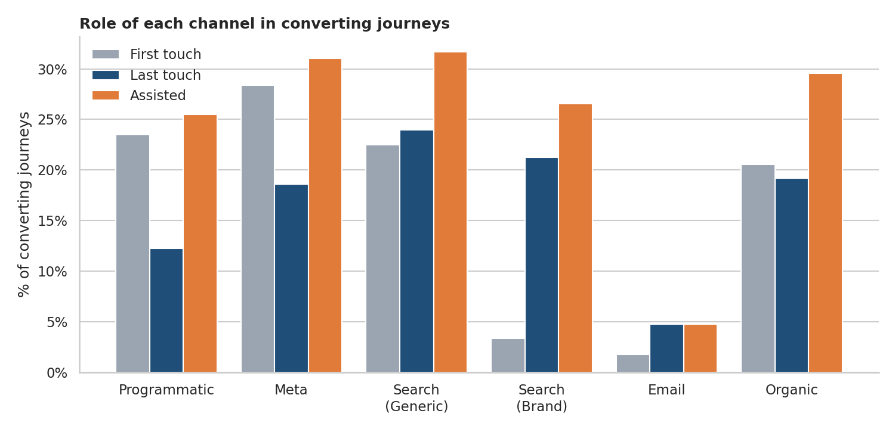
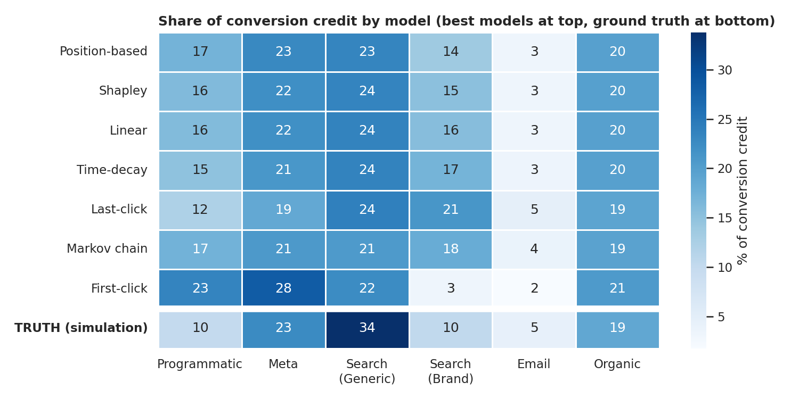
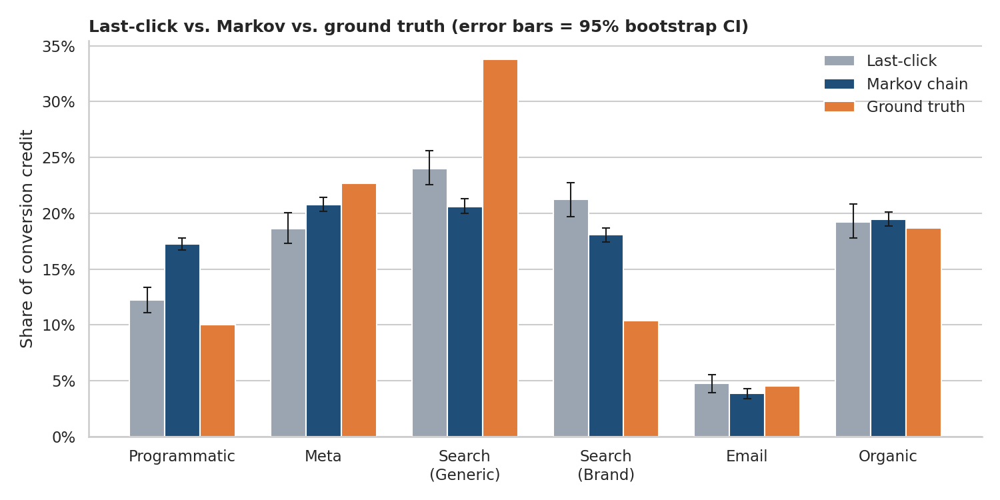
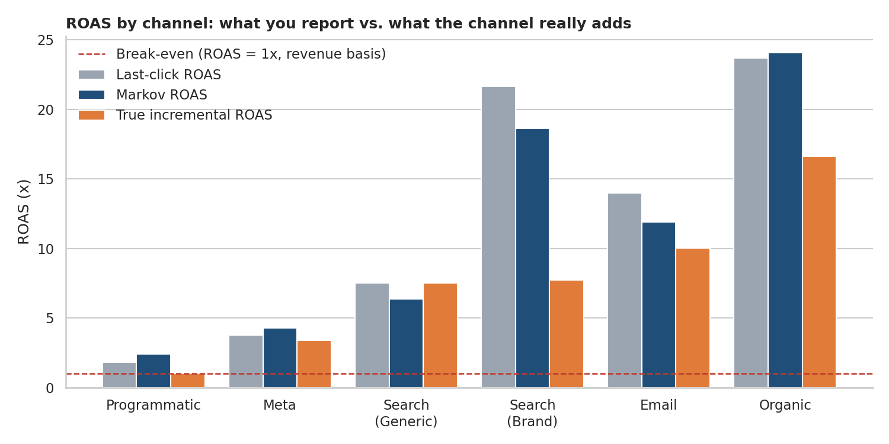

# Multi-Touch Attribution: Last-Click vs. Markov Chains vs. Shapley

### Grading attribution models against a known ground truth

**Personal / hands-on digital marketing + data analytics project**

> **Note:** This is a personal practice project. The journey data is **simulated**
> (reproducible with `data/generate_data.py`). It does not come from a live client
> account. The methodology, however, is the same I would apply to a real export of
> touchpoints and conversions. Channel-level conclusions are consequences of the
> parameters I assumed; the value of the project is the **method**.

---

## Context

Most accounts still report conversions by *last click*. In my retention project
([`retention-marketing-rfm-clv`](https://github.com/TomasVargas1911/retention-marketing-rfm-clv)) I flagged that
last-touch reporting can distort how awareness channels such as Programmatic look. This project tests that
properly, and connects with my [paid-media budget project](https://github.com/TomasVargas1911/paid-media-budget-optimization)
(the spend per channel is the week-4 mix of that project, scaled to three months).

> **If we credit conversions with different attribution models, how much do the answers differ,
> which model is closest to the truth, and what would that change in the budget?**

**Why simulated data is an advantage here:** in a real account the true incremental effect of a channel is never
observable. Because I generated the journeys, I kept the hidden causal lift of every touch, so each model can be
**graded against the truth**. (In a real account that role is played by incrementality experiments.)

## Objectives

- Clean raw tracking data and build customer journeys.
- Compare 5 rule-based models (last-click, first-click, linear, time-decay, position-based) with 2 data-driven models (**Markov chain**, **Shapley values**).
- Quantify the uncertainty of the results (bootstrap confidence intervals).
- Validate every model against ground truth and translate credit into **ROAS and budget implications**.

## Tools used

Python (pandas, NumPy, matplotlib, seaborn), Jupyter Notebook. Markov chains solved with absorbing-state linear algebra; exact Shapley values over 2^6 coalitions.

## Dataset (simulated)

| Table | Rows | Fields |
|---|---|---|
| `touchpoints.csv` | 136,800 | `user_id`, `touch_time`, `channel` |
| `conversions.csv` | 2,669 | `user_id`, `conversion_time`, `revenue` |
| `channel_spend.csv` | 6 | `channel`, `spend`, `spend_source` |
| `ground_truth.csv` | 7 | true incremental conversions per channel (**used only in the validation section**) |

60,000 users, 6 channels (Programmatic, Meta Ads, Google Search Generic, Google Search Brand, Email, Organic/SEO),
July to October 2025. Paths follow a funnel (awareness channels often lead to Brand Search) and every touch has a small causal lift with
diminishing returns (ad fatigue). The data is deliberately messy: inconsistent channel names, duplicate rows, post-conversion touches.

## Process

1. **Data cleaning:** standardised 2,720 channel names, removed 681 duplicates, 133 post-conversion touches and 28 touches outside a 30-day lookback.
2. **Journey building:** 60,000 journeys, 2,669 conversions (4.45%), average order value $69.57.
3. **Path analysis:** conversion rate by path length, top paths, first/last/assist roles per channel.
4. **Rule-based attribution:** 5 models; each one is checked to distribute exactly the observed conversions.
5. **Markov chain:** transition matrix and removal effects, validated to reproduce the observed conversion rate exactly; **500 bootstrap resamples** for 95% intervals.
6. **Shapley values:** exact, over all 64 channel coalitions.
7. **Validation against ground truth:** mean absolute error, rank correlation, bootstrap coverage.
8. **ROAS and budget:** last-click vs. Markov vs. true incremental ROAS.

## Key results

| Finding | Result |
|---|---|
| Multi-touch journeys | 76% of converters have 2+ touches; median 4.7 days from first touch to conversion |
| Channel roles | Programmatic is the top assister (assist ratio 2.1); Brand Search is mostly a closer (89 first vs. 567 last touches) |
| Model choice matters | Brand Search receives 3% (first-click) to 21% (last-click) of credit; Programmatic 12% to 23% |
| Accuracy vs. truth | Mean absolute error 3.9 to 5.2 share points for every model except first-click (7.0) |
| Sophistication is not accuracy | Markov (5.2 pts) did not beat position-based (3.9 pts); its narrow 95% intervals exclude the true share for all six channels |
| Baseline demand | ~25% of conversions (659) would have happened with no marketing touch; no attribution model can see this |

**Model comparison (share of conversion credit, %)**

| Model | Programmatic | Meta | Search (Generic) | Search (Brand) | Email | Organic | MAE vs. truth |
|---|---|---|---|---|---|---|---|
| Position-based | 17 | 23 | 23 | 14 | 3 | 20 | 3.9 |
| Shapley | 16 | 22 | 24 | 15 | 3 | 20 | 4.0 |
| Linear | 16 | 22 | 24 | 16 | 3 | 20 | 4.0 |
| Time-decay | 15 | 21 | 24 | 17 | 3 | 20 | 4.2 |
| Last-click | 12 | 19 | 24 | 21 | 5 | 19 | 4.6 |
| Markov chain | 17 | 21 | 21 | 18 | 4 | 19 | 5.2 |
| First-click | 23 | 28 | 22 | 3 | 2 | 21 | 7.0 |
| **Ground truth** | **10** | **23** | **34** | **10** | **5** | **19** | n/a |

**ROAS by channel: reported vs. true incremental**

| Channel | Spend | Last-click ROAS | Markov ROAS | True incremental ROAS |
|---|---|---|---|---|
| Programmatic | $13,200 | 1.8x | 2.4x | 1.0x |
| Meta Ads | $9,000 | 3.8x | 4.3x | 3.4x |
| Google Search (Generic) | $6,000 | 7.5x | 6.4x | 7.5x |
| Google Search (Brand) | $1,800 | 21.6x | 18.6x | 7.7x |
| Email* | $600 | 14.0x | 11.9x | 10.0x |
| Organic / SEO* | $1,500 | 23.7x | 24.1x | 16.6x |

\*Spend for Email and Organic is an assumed allocation. Paid-channel spend comes from the simulated mix of
[`paid-media-budget-optimization`](https://github.com/TomasVargas1911/paid-media-budget-optimization).

**A hypothesis I got wrong, and why it is useful:** I expected last-click to *undervalue* Programmatic. In this
simulation it does the opposite: Programmatic assists the most conversions, but its true causal effect is small, so
every model over-credits it. Assisting a conversion is not the same as causing it.

## Visualizations

**Role of each channel in converting journeys**



**Credit by model vs. ground truth**



**Last-click vs. Markov (95% bootstrap CI) vs. truth**



**ROAS: what you report vs. what the channel adds**



## Recommendations

| Channel | Suggested action |
|---|---|
| Google Search (Brand) | Keep it, but do not scale on last-click ROAS. Run a brand-search holdout in matched regions to measure real lift. |
| Programmatic | Geo-lift test with a 30-50% spend cut, cap frequency, shift budget to Generic Search and Meta while the test runs. |
| Google Search (Generic) | Most under-credited channel: test a budget increase and track marginal ROAS. |
| Meta Ads | Attribution is roughly right; focus on creative testing. |
| Email / Organic | Highly efficient but small: grow the subscriber list and protect content investment. |

**Measurement principles:** treat attribution as directional and report credit as a range across models; use
incrementality experiments where models disagree most; calibrate the models with the experiment results.

## Key learnings and skills demonstrated

- Turning raw tracking logs into customer journeys (cleaning, deduplication, lookback windows, post-conversion filtering).
- Implementing rule-based, Markov chain and Shapley attribution from scratch.
- Quantifying uncertainty with bootstrap, and understanding that narrow intervals do not guarantee accuracy.
- Evaluating models against a known truth, and distinguishing attribution from incrementality.
- Translating results into budget decisions and an experiment plan.

## Limitations and next steps

- **Simulated data:** channel lifts, funnel structure and spend are assumptions, so the channel-level results are not benchmarks.
- **Ground truth is model-based** (a noisy-OR conversion model with ad fatigue).
- **The simulated paths are a first-order Markov chain**, which should favour the Markov model; real journeys have longer memory.
- No cross-device or identity issues, and no view-through vs. click distinction.
- Shapley uses converting journeys only, a known limitation of the common formulation.
- **Next steps:** higher-order Markov models, a Marketing Mix Model (MMM) to complement user-level attribution, and a real public journey dataset.

## How to run

```bash
git clone https://github.com/TomasVargas1911/multi-touch-attribution.git
cd multi-touch-attribution
pip install -r requirements.txt
python data/generate_data.py            # regenerates the simulated CSVs (seed = 42)
jupyter notebook notebooks/attribution_analysis.ipynb
```

## Repository structure

```
├── data/
│   ├── generate_data.py      # simulated journeys + hidden ground truth
│   ├── touchpoints.csv
│   ├── conversions.csv
│   ├── channel_spend.csv
│   └── ground_truth.csv
├── notebooks/
│   └── attribution_analysis.ipynb
├── images/                   # charts used in this README
├── reports/
│   └── channel_attribution_summary.csv
├── requirements.txt
└── LICENSE
```

---

*All figures in this project are simulated for practice and portfolio purposes.*
